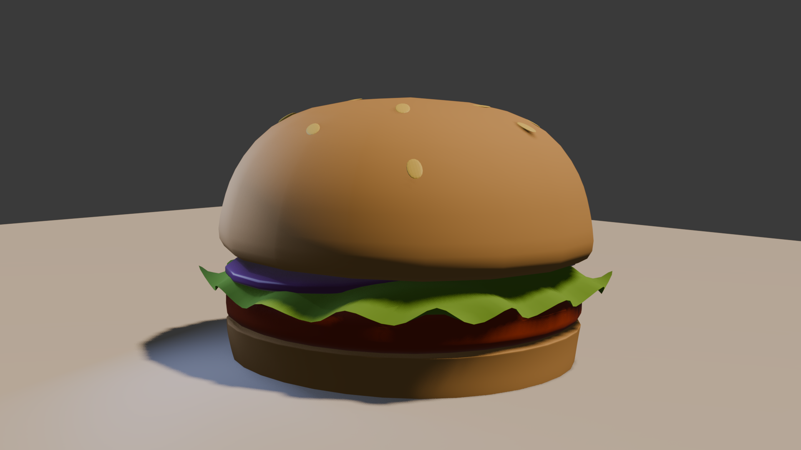

# Render Hamburguesa - Primer Proyecto 3D

Este es mi primer render 3D de una hamburguesa realizado para practicar modelado, materiales, iluminación y composición dentro de un entorno 3D.

## Tecnologías / Software

* Blender
* Render Cycles / Eevee
* Materiales PBR básicos
* Iluminación de estudio

## Características del proyecto

* Modelado simple de hamburguesa
* Uso de materiales para pan, carne, queso y vegetales
* Iluminación cálida para resaltar detalles
* Práctica de sombras y reflejos
* Render enfocado en realismo básico

## Lo que aprendí

* Configuración de luces
* Aplicación de materiales
* Ajuste de colores y texturas
* Uso de cámara y composición
* Configuración de render

## Preview

```md id="1ltvrn"

```

## Objetivo

Este proyecto fue realizado como práctica personal para mejorar habilidades en modelado y renderizado 3D.

## Estado del proyecto

Finalizado
Proyecto de aprendizaje y práctica inicial
